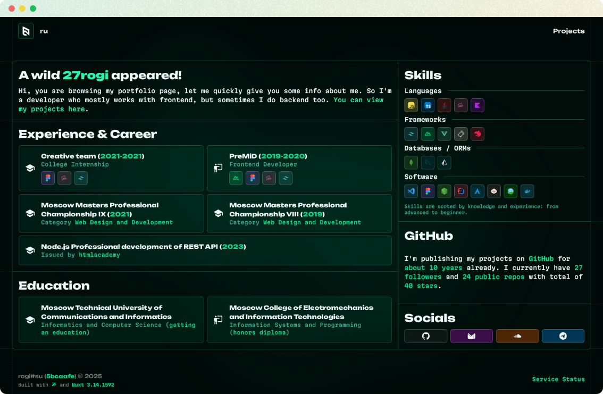

  

# 🍃 [rogi#su](https://rogi.party)

This is a portfolio website that I made to list all of my most notable projects and also give small glimpse into my skills and career. I decided to use Nuxt for fast and painless development. The color palette of this website mostly features [`Green Spring`](https://en.wikipedia.org/wiki/Spring_green) tones with some darker variations. Most of the styles are written using UnoCSS with Tailwind preset and directives.

## Bun experiment

The latest generation of my website is built with Bun and uses its environment implementation, Docker builds also use special Nitro preset made to work with Bun. Due to this radical approach some features might not work on Node or vice versa. If you notice some issues with the website you can create an issue.

## Used stack

* Nuxt 4 (ready for Nuxt 5)
* Elysia (for API endpoints)
* Vite 8
* UnoCSS (with Tailwind 4 preset)
* Bun (using Bun's Node environment implementation)
* TypeScript

## Features

* Icons (by Iconify using @nuxt/icon)
* Core Web Vitals optimizations
* Sitemap, Meta Tags, Open Graph, Twitter Cards (@nuxtjs/seo)
* Internationalization (nuxt-i18n-micro)
* Code Linting (ESLint using @antfu config with tweaks)
* Cross Origin Resource Sharing tweaks (nuxt-security)
* ...and something else, I'm just lazy to write it all down :)

## Development

To start development you only need to install Bun latest version, other steps are identical to default Nuxt [guide](https://nuxt.com/docs/getting-started/installation#development-server).
